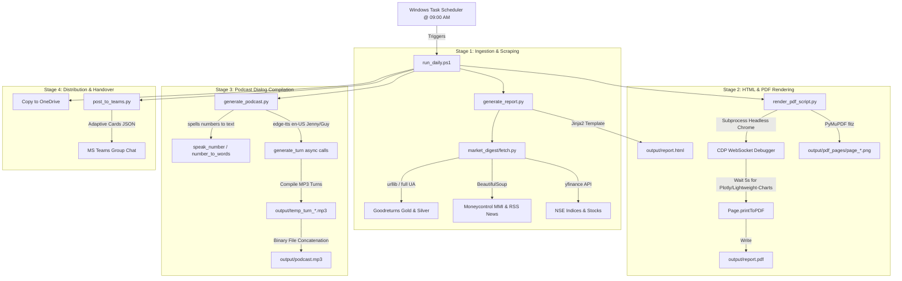

# Project Architecture - Market Digest Automated Briefing System

This document provides a comprehensive technical overview of the system architecture, data flow, and file layout of the **Market Digest** project.

---

## 1. High-Level Architectural Design

Market Digest is a local-first, zero-license-cost automated publishing pipeline. It operates as a multi-stage sequential batch processor that runs daily to create two primary outputs:
1. A **11-Page PDF Report** containing stock market summaries, technical charts, news bulletins, and spot commodities rates.
2. A **Dual-Speaker Audio Podcast (`podcast.mp3`)** presenting the same market update in a natural, conversational format.



---

## 2. Directory & Component Inventory

Below is the tree layout of the codebase and its files:

```
Market Digest/
│
├── market_digest/                     # Core library package
│   ├── templates/
│   │   ├── report.html.j2             # Jinja2 HTML layout and print CSS rules
│   │   ├── lightweight-charts.js      # JS library for interactive candles
│   │   └── plotly.min.js              # JS library for advanced plot rendering
│   ├── __init__.py
│   └── fetch.py                       # Scrapers and data parsers (NSE, MC, Goodreturns)
│
├── output/                            # Daily compiled assets (Generated)
│   ├── market-digest-YYYY-MM-DD.html  # Today's compiled raw report
│   ├── report.html                    # Symbolic target report for local debug
│   ├── report.pdf                     # Final A4 PDF publication file
│   ├── podcast.mp3                    # Final dual-speaker podcast audio
│   └── pdf_pages/                     # PNG extractions of PDF pages for mobile previews
│       └── page_01.png ... page_11.png
│
├── scratch/                           # Diagnostic and test scripts
│   ├── test_fetch_bullion.py          # Goodreturns bullion fetch verification
│   └── generate_market_digest_doc.py  # technical word doc generation
│
├── generate_report.py                 # Top-level coordinator for HTML building
│   generate_podcast.py                # Top-level podcast compiler and spelling formatter
│   post_to_teams.py                   # MS Teams publication integration
│   run_daily.ps1                      # Master PowerShell daily runner (Scheduler target)
│   schedule_task.ps1                  # Setup script to register Task Scheduler task
│   README.md                          # Brief developer setup handbook
│   Project_Architecture.md            # [THIS FILE] System architectural overview
└── Project_Market_Digest_Complete_Documentation.md # Technical specification report
```

---

## 3. Step-by-Step Data Flow & Pipeline Stages

### Stage 1: Multi-Source Data Ingest (`market_digest/fetch.py`)
Data is scraped using Python's standard `urllib` and `requests` libraries.
1. **Market Indices & Equities (NSE)**: Standard Yahoo Finance (`yfinance`) quotes fetch prices for `^NSEI` (Nifty 50) and `^NSEMDCP50` (Midcap). Sector charts and stocks lists are resolved using standard dataframes.
2. **Volatilities (VIX)**: Fetches India VIX absolute close values and calculates percentage moves.
3. **Sentiment & Market Mood (MMI)**: Moneycontrol's Market Mood Index landing widget is scraped using BeautifulSoup. RSS feeds for Market Reports, Business News, and Buzzing Stocks are fetched, deduplicated, and filtered via regex to drop sales/broker spam headlines.
4. **Bullion rates (Goodreturns)**: Chennai gold/silver rates are fetched using `urllib` with a full browser `User-Agent` to bypass Cloudflare anti-scraping blocks. Tabular gold data is parsed per gram and converted to 8-gram units. Silver data is extracted per gram and per kilogram.

### Stage 2: HTML Page Compilation (`generate_report.py`)
1. Data dictionary is aggregated from `fetch_all()`.
2. Environment calls Jinja2 engine, loading the `report.html.j2` template.
3. Variables are injected into layout containers. Symmetrical gold and silver sections are isolated and formatted.
4. CSS styling is injected directly (Tailwind-free vanilla flexbox grids, glassmorphism filters, page-break print styles).
5. Output page is written to `output/market-digest-YYYY-MM-DD.html`.

### Stage 3: CDP Headless PDF Rendering (`render_pdf_script.py`)
WeasyPrint is avoided due to unstable JS rendering of chart libraries. Headless Chrome/Edge is launched programmatically:
1. Launches Chrome with `--headless=new` and `--remote-debugging-port=9222`.
2. Connects to the DevTools Page Debugger via WebSockets.
3. Navigates to `report.html?print=true`.
4. Waits **5 seconds** for Plotly and Lightweight-Charts scripts to execute and visually stabilize.
5. Invokes `Page.printToPDF` with options: `printBackground: True`, `preferCSSPageSize: True`.
6. Decodes base64 print binary and writes to `output/report.pdf`. (Gracefully falls back to `report_preview.pdf` if permission is locked).
7. Uses PyMuPDF (`fitz`) to output A4 pages into 120 DPI PNGs (`pdf_pages/page_*.png`) for rapid mobile previews.

### Stage 4: Dialogue Speech Synthesis (`generate_podcast.py`)
1. Fetches current market quotes.
2. Formats all raw floats and integers using the custom spelling engine:
   - Numbers are expanded to text words (e.g. `23,907.15` -> "twenty-three thousand nine hundred and seven point one five") to bypass digit-by-digit TTS readouts.
   - Signs (`+`/`-`) are expanded to "plus" / "minus".
3. Maps speech scripts into a conversational dialogue array between Arjun (`en-US-GuyNeural`) and Neha (`en-US-JennyNeural`).
4. Slows rates to `-2%` using SSML pacing.
5. Bypasses SSL certificate blocks (corporate firewall) by globally patching `aiohttp.ClientSession._request`.
6. Downloads speech turns asynchronously in parallel.
7. Performs simple binary file aggregation to output the compiled `podcast.mp3`.

---

## 4. Key Architectural Features & Solutions

- **Cloudflare / Bot-Block Bypass**: Fetching bullion rates via standard `urllib.request` using system SSL ciphers. Overriding TLS configuration (via verify=False or unverified SSL contexts) alters the TLS fingerprint, leading Cloudflare to return a `403 Forbidden` response. Allowing normal system certificate validation bypasses blocks.
- **SSL Firewall Monkey-Patching**: Modifies the `aiohttp` networking pipeline in `generate_podcast.py` to prevent SSL verification failures within strict proxy environments:
  ```python
  original_request = aiohttp.ClientSession._request
  async def patched_request(self, *args, **kwargs):
      kwargs['ssl'] = False
      return await original_request(self, *args, **kwargs)
  aiohttp.ClientSession._request = patched_request
  ```
- **Symmetrical 11-Page PDF Compilation**: HTML classes leverage CSS `@media print { .module { page-break-after: always; } }` to force exactly one module section per A4 page. Split-page pagination rules split Gold and Silver into independent pages (Pages 8 and 9) with symmetrical component matrices.
- **Headless Chrome Rendering Orchestrator**: Direct JSON protocol calls over raw WebSocket connections allow maximum control over navigation, chart timeouts, and A4 print options without Selenium/Puppeteer overhead.
- **Financial Pronunciation Wrapper**: Converts floats and formatting strings into word formats before TTS encoding to ensure high naturalness.
