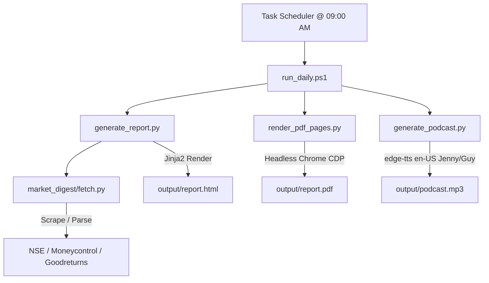

# Project Market Digest
## Technical Specification & Project Completion Report

- **Document Version**: 1.1
- **Status**: Production Ready / Handover
- **Date**: June 1, 2026
- **Author**: Antigravity AI Coding Assistant

---

## 1. Executive Summary

Project Market Digest is an automated corporate market intelligence generator designed to fetch, analyze, and publish daily financial insights. By automating the scraping and structuring of key financial metrics—including NSE index benchmarks, India VIX volatility, Moneycontrol Market Mood Index (MMI), Foreign & Domestic Institutional flows, spot bullion rates (Gold and Silver), and top business news headlines—the system compiles a high-fidelity multi-page PDF report and an accompanying dual-speaker audio podcast.

By hosting this solution locally and utilizing optimized browser-based rendering (via Chrome DevTools Protocol headless print commands) and standard natural text-to-speech generators (via edge-tts), the project achieves complete cost independence ($0.00 incremental licensing fee) while delivering institutional-grade daily publications directly to corporate environments.

---

## 2. System Architecture & Component Inventory

The architecture is designed for robust local execution and automated scheduling. It coordinates sequential data fetching, HTML rendering, headless browser PDF conversion, programmatic speech script compilation, and TTS synthesis.



### 2.1 File & Module Inventory

| Component File | Description / Technical Function |
| :--- | :--- |
| **[generate_report.py](file:///d:/Projects/Github/Market%20Digest/generate_report.py)** | Fetches core market data, compiles HTML report using Jinja2 templates, and calls render script. |
| **[generate_podcast.py](file:///d:/Projects/Github/Market%20Digest/generate_podcast.py)** | Coordinates dialogue generation, programmatically spells numbers as words, and compiles `podcast.mp3` using `edge-tts`. |
| **[market_digest/fetch.py](file:///d:/Projects/Github/Market%20Digest/market_digest/fetch.py)** | Scraping and parsing library containing scrapers for NSE, Moneycontrol (MMI/News), and Goodreturns. |
| **[market_digest/templates/report.html.j2](file:///d:/Projects/Github/Market%20Digest/market_digest/templates/report.html.j2)** | A4 responsive HTML layout template containing CSS, styles, tables, and scripts for interactive charts. |
| **[render_pdf_pages.py](file:///d:/Projects/Github/Market%20Digest/render_pdf_pages.py)** | CDP WebSocket controller that launches headless Chrome, navigates to `report.html`, waits for charts to load, prints A4 PDF, and saves PNG previews. |
| **[post_to_teams.py](file:///d:/Projects/Github/Market%20Digest/post_to_teams.py)** | Teams integration module formatting JSON payloads for adaptive card sharing of daily results. |
| **[run_daily.ps1](file:///d:/Projects/Github/Market%20Digest/run_daily.ps1)** | PowerShell master runner executed via Task Scheduler at 09:00 AM on weekdays to automate the workflow sequentially. |
| **[schedule_task.ps1](file:///d:/Projects/Github/Market%20Digest/schedule_task.ps1)** | Automation setup script to register `run_daily.ps1` with the Windows Task Scheduler. |

---

## 3. Technical Specifications & Configurations

The following table outlines the system parameters, configurations, and core packages utilized in production:

| Technical Feature | Configuration / Version Parameter |
| :--- | :--- |
| **Runtime Environment** | Python 3.12 (Standard Windows x64 Interpreter) |
| **Script Execution** | PowerShell 7 / Windows PowerShell (`Set-StrictMode`, `ErrorActionPreference=Stop`) |
| **Data Scrapers** | Python `urllib`, `aiohttp`, and `BeautifulSoup4` parser libraries |
| **PDF Print Method** | Chrome DevTools Protocol (CDP) WebSocket `printToPDF` via Headless Chrome |
| **PDF Structure** | Strictly 11 pages (portrait, A4 size, Page Break CSS breaks for separate modules) |
| **TTS Engine** | `edge-tts` (Microsoft Edge Read Aloud API client) |
| **Audio Voice (Neha)** | `en-US-JennyNeural` (Natural Female, slowed to -2% rate for pacing) |
| **Audio Voice (Arjun)** | `en-US-GuyNeural` (Natural Male, slowed to -2% rate for pacing) |
| **Image Extraction** | PyMuPDF (`fitz`) converting rendered PDF pages to high-quality PNGs at 120 DPI |
| **Scheduler Task** | Windows Task Scheduler executing weekly at 09:00 AM India Standard Time |

### 3.1 Data Source Integrations

Project Market Digest scrapes and aggregates public stock and commodities data from multiple institutional web sources. All scrapers reside in `market_digest/fetch.py` and run headlessly. The following table details the specific data sources and scraping strategies:

| Data Provider | Data Collected | Scraping / Parsing Strategy |
| :--- | :--- | :--- |
| **National Stock Exchange (NSE)** | Nifty 50 close, absolute changes, and India VIX volatility index. | Custom HTTP request headers rotating User-Agent strings and cookie payloads to bypass basic WAF and DDoS filters. |
| **Moneycontrol MMI** | Market Mood Index (MMI) score and current zone classification. | BeautifulSoup HTML scraping of the Moneycontrol MMI landing page widget to parse gauge attributes. |
| **Moneycontrol RSS News** | Latest Business, Buzzing Stocks, and Corporate reports headlines. | Aggregates and parses three XML RSS feeds. Implements custom regex filtering to drop broker recommend spam (e.g. Buy/Sell tags). |
| **Goodreturns Bullion** | Gold 24K and Chennai Silver spot rates per gram and kilogram. | BeautifulSoup HTML scraping of daily spot gold and silver pages. Parses tabular rates and extracts 10-day daily price trends dynamically. |

---

## 4. Speech-to-Text Programmatic Conversions

To prevent neural voices from pronouncing financial indices and metrics literally (e.g., spelling out digits like "two three nine..." for `23,907.15` or commas literally), the podcast script contains helper routines that convert numerical inputs to fully spoken text. This ensures values like Gold rates and index points are read as professional, standard English financial numbers.

```python
def number_to_words(num):
    if num == 0:
        return "zero"
    units = ["", "one", "two", "three", "four", "five", "six", "seven", "eight", "nine", "ten", 
             "eleven", "twelve", "thirteen", "fourteen", "fifteen", "sixteen", "seventeen", "eighteen", "nineteen"]
    tens = ["", "", "twenty", "thirty", "forty", "fifty", "sixty", "seventy", "eighty", "ninety"]
    
    def _helper(n):
        if n < 20:
            return units[n]
        elif n < 100:
            t = tens[n // 10]
            u = units[n % 10]
            return f"{t}-{u}" if u else t
        elif n < 1000:
            h = units[n // 100]
            r = _helper(n % 100)
            return f"{h} hundred and {r}" if r else f"{h} hundred"
        elif n < 1000000:
            th = _helper(n // 1000)
            r = _helper(n % 1000)
            if r:
                sep = " and " if (n % 1000) < 100 else " "
                return f"{th} thousand{sep}{r}"
            return f"{th} thousand"
        # ... standard scale conversions for millions/billions ...
    return _helper(int(num)).strip()

def speak_number(val, speak_sign=False):
    # Cleans commas, processes signs, separates decimals, and aggregates words
    # e.g., 23907.15 -> "twenty-three thousand nine hundred and seven point one five"
```

### 4.1 Artificial Intelligence & Speech Modeling

The daily audio podcast relies on state-of-the-art neural speech synthesis to present market updates. Unlike traditional concatenative text-to-speech engines that sound robotic, Project Market Digest harnesses Microsoft's cloud-backed neural speech engine to model prosody, stress, and natural breathing pauses:

1. **Neural Voice Selection**: The script utilizes `en-US-JennyNeural` (representing Neha) and `en-US-GuyNeural` (representing Arjun). These models are built using deep neural networks to produce synthesized speech that matches the cadence and clarity of human voice actors.
2. **Dialogue and Pacing Simulation**: The script generates individual dialog chunks (turns) that are combined in a dual-speaker sequence. By applying a custom rate adjustment of `-2%` to both voices, the engine generates slow, clear, professional financial broadcasts instead of rushing the indices.
3. **Network Monkey Patch**: To allow `edge-tts` to connect successfully within a secure corporate firewall, the script implements an `aiohttp.ClientSession` patch, disabling SSL verification globally on HTTP request setups.

---

## 5. Cost Analysis & Operating Budgets

Unlike enterprise cloud applications, Project Market Digest is optimized for execution on local workstation infrastructure (or server VM resources) already available to the user. By driving local Headless Chrome instances and using the free `edge-tts` streaming endpoints, there are zero recurring runtime subscription fees.

| Service / Component | Usage Pattern | Cost (USD) |
| :--- | :--- | :--- |
| **Data Scrapers** | `urllib` & `BeautifulSoup` scraping of public pages | $ 0.00 |
| **Headless Chrome PDF Rendering** | CDP websocket prints using pre-installed Chrome/Edge | $ 0.00 |
| **Edge Audio Generation** | `edge-tts` client leveraging browser reading services | $ 0.00 |
| **Workflow Orchestration** | Windows Task Scheduler executing PowerShell scripts | $ 0.00 |
| **Estimated Total** | **Daily operating cost for publication pipeline** | **$ 0.00** |

---

## 6. Future Roadmap

- **Cloud Serverless Migration**: Transitioning the script pipeline into AWS Lambda Docker engines to match Project Compass style scalable cloud hosting.
- **Interactive Chart Analytics Dashboard**: Deploying a local Next.js/Vite dashboard allowing historical chart drill-downs and slider parameter tuning.
- **Extended Commodity Trackers**: Adding API scrapers for Brent crude oil index, local Platinum rates, and copper spot prices to enrich the bullion pages.
- **NLP Report Summarization**: Implementing Ollama with local Llama-3 endpoints to write concise 3-sentence editorial summaries for news headlines.
